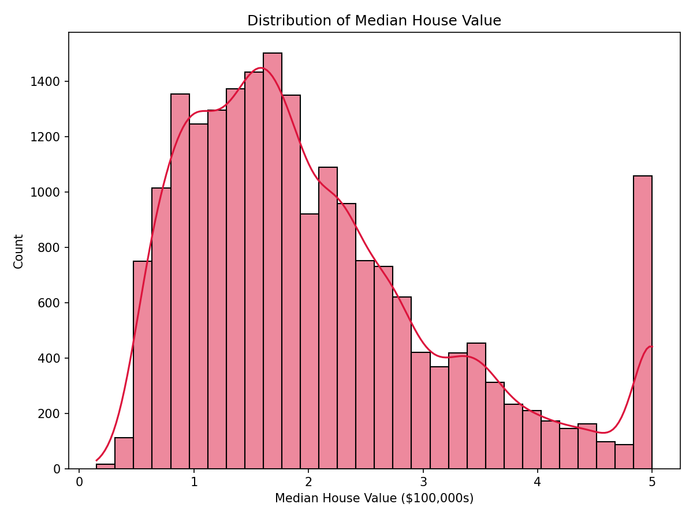
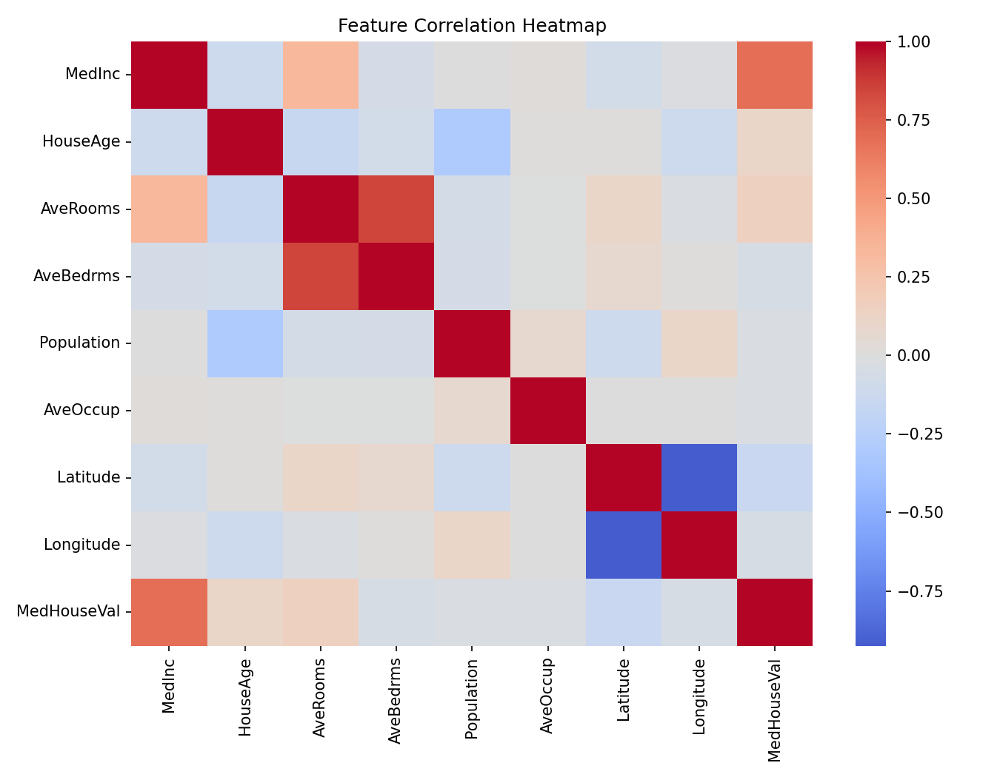

## California Housing Dataset — EDA and Model Comparison

[](https://github.com/Harini-Balaji11/California-housing-dataset-EDA-and-Model-comparison/actions/workflows/ci.yml)
[](https://github.com/Harini-Balaji11/California-housing-dataset-EDA-and-Model-comparison/actions/workflows/pages.yml)

Live report (static): published via GitHub Pages (Settings → Pages). Once enabled, use the exact URL shown there.

### Highlights
- **Clean EDA**: Distribution, correlations, geospatial context, outliers
- **Baselines**: Linear Regression, Ridge, Lasso, Random Forest, Gradient Boosting
- **Reproducible**: One‑command setup and HTML report export
- **Well‑structured**: Clear directories, scripts, and environment setup

### Executive Summary
- Median house value is positively associated with `MedInc` and proximity to coastal latitude/longitude bands.
- Correlations highlight `MedInc` as strongest single predictor among features provided.
- Regularized linear models perform similarly to OLS; tree‑based models (Random Forest, Gradient Boosting) often reduce RMSE further.
- Target distribution is right‑skewed; consider log‑transform for alternative modeling.

### Repository Structure
```
.
├─ notebooks/
│  └─ 01_eda_california_housing.ipynb        # Main EDA & insights
├─ scripts/
│  ├─ run_eda.py                             # Generate EDA figures
│  └─ run_models.py                          # Train & compare models
├─ reports/
│  ├─ figures/                               # Auto‑generated plots
│  └─ eda_report.html                        # Optional HTML export
├─ assets/
│  └─ figures/                               # Committed visuals for README
├─ requirements.txt
├─ Makefile                                  # Export notebook to HTML
├─ .gitignore
├─ LICENSE
└─ README.md
```

### Quickstart
1) Create and activate a virtual environment (recommended)
```bash
python -m venv .venv
.venv\Scripts\activate  # Windows
```

2) Install dependencies
```bash
pip install -r requirements.txt
```

3) Run EDA figures and baseline model comparison
```bash
python scripts/run_eda.py
python scripts/run_models.py
```

4) Optional: Export notebook as an HTML report
```bash
make report
```
The figures are saved in `reports/figures/` (runtime) and `assets/figures/` (committed). HTML goes to `reports/eda_report.html`.

Python version: 3.11 recommended.

### What’s inside the notebook
- Data overview and sanity checks (shape, types, missing values)
- Descriptive statistics and target analysis (skew, outliers)
- Feature distributions and correlation heatmap
- Simple geospatial scatter by latitude/longitude
- Baseline regressors and evaluation (e.g., MAE, RMSE, R²)

### Selected Visuals



### Dataset
The California Housing dataset is loaded via `sklearn.datasets.fetch_california_housing`. No external download is needed. Target is `MedHouseVal`; features include `MedInc`, `HouseAge`, `AveRooms`, `AveBedrms`, `Population`, `AveOccup`, `Latitude`, and `Longitude`.

### Reproducing results
All results can be reproduced by running the scripts and/or opening `notebooks/01_eda_california_housing.ipynb`. To create a shareable report, use `make report` which converts the notebook to HTML via `nbconvert`.

### Requirements
See `requirements.txt` for pinned packages. Key libraries:
- pandas, numpy, matplotlib, seaborn
- scikit‑learn
- jupyter, nbconvert

Conda users can use `environment.yml`.

### License
This project is released under the MIT License. See `LICENSE` for details.

### Deployment
- Static site only: GitHub Pages publishes the HTML report (`reports/index.html`). Enable in Settings → Pages.